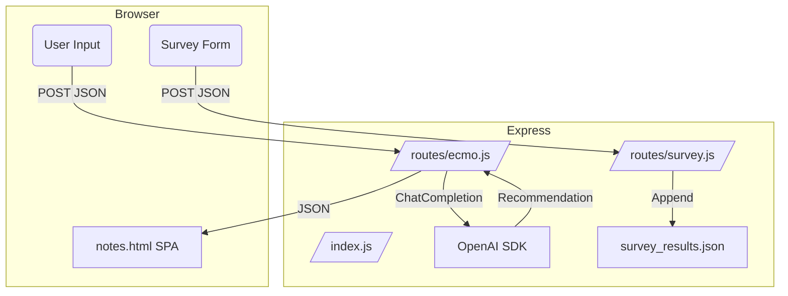

# ECMO‑SVC Score AI Tool

*AI‑assisted decision support for extracorporeal membrane oxygenation (ECMO) timing in Superior Vena Cava (SVC) syndrome*

---

## Table of Contents
1. [Project Overview](#project-overview)
2. [Features](#features)
3. [Directory Structure](#directory-structure)
4. [Quick Start](#quick-start)
5. [Environment Variables](#environment-variables)
6. [Scripts](#scripts)
7. [API Reference](#api-reference)
8. [Data Flow & Architecture](#data-flow--architecture)
9. [Screenshots](#screenshots)
10. [Contributing](#contributing)
11. [License](#license)

---

## Project Overview
This repo contains a **single‑page web application** (SPA) and **Node.js/Express backend** that together provide real‑time, AI‑driven recommendations for initiating ECMO in patients with SVC syndrome.

The backend exposes secure REST endpoints that forward clinician‑entered patient data to **OpenAI GPT‑4o** for scoring and returns structured recommendations. A lightweight usability survey records feedback in JSON for iterative improvement.

---

## Features
| Feature | Description |
|---------|-------------|
| 🔍 **ECMO‑SVC Scoring** | Computes domain scores (symptom, vascular, anatomic, hemodynamic) and recommends ECMO timing. |
| 📝 **Rich Note Parsing** | Free‑text H&P input is parsed and mapped to score domains. |
| 🎨 **Tailwind UI** | Responsive, dark‑mode‑aware front‑end with print‑ready styling. |
| 🗂 **JSON Survey Storage** | Anonymous usability survey saved to **`/server/data/survey_results.json`**—no DB required. |
| 🔐 **.env Support** | Backend consumes `OPENAI_API_KEY` from environment for secure API calls. |

---

## Directory Structure
```txt
root
├── .DS_Store               # macOS artifact (ignored)
└── server                  # Backend + static SPA
    ├── data
    │   └── survey_results.json    # User feedback
    ├── public              # Front‑end (served as static assets)
    │   ├── assets/cov.png  # Logo
    │   ├── notes.html      # SPA (Tailwind + Vanilla JS)
    │   └── ecmo-scorer.code-workspace # VS Code workspace
    ├── routes
    │   ├── ecmo.js         # POST /api/ecmo-score – OpenAI logic
    │   └── survey.js       # POST /api/survey – store survey JSON
    ├── index.js            # Express entry‑point
    ├── package.json        # NPM metadata
    └── .gitignore          # Node / editor ignores
```

---

## Quick Start
```bash
# 1 Clone and enter project
$ git clone https://github.com/<your-username>/ecmo-scorer.git
$ cd ecmo-scorer/server

# 2 Install backend deps
$ npm install

# 3 Create .env (see below)
$ echo "OPENAI_API_KEY=sk-..." > .env

# 4 Run
$ node index.js  # or PORT=3000 node index.js

# 5 Visit
# http://localhost:8080 (or chosen PORT)
```

> **NOTE:** The SPA is fully static—no bundler required. If you prefer HTTPS or production reverse‑proxy, place the **`server`** folder behind Nginx or Railway’s Node service.

---

## Environment Variables
| Key | Required | Description |
|-----|----------|-------------|
| `OPENAI_API_KEY` | ✅ | Secret token with *chat.completions* scope. |
| `PORT` | optional | Port Express listens on (defaults to `8080`). |

---

## Scripts
```json
"scripts": {
  "start": "node index.js",
  "dev":   "nodemon index.js"
}
```
Use **`npm run dev`** during development for auto‑reload (requires `nodemon`).

---

## API Reference
### POST `/api/ecmo-score`
Body ➜ `application/json`
```jsonc
// mode "dropdown" – structured UI
{
  "mode": "dropdown",
  "data": {
    "symptom": "severe dyspnea",
    "vascular": "engorged neck veins",
    "anatomic": ">50% tracheal compression",
    "hemodynamic": "BP 90/55, HR 130",
    "notes": "post‑thymoma resection"
  }
}

// mode "notes" – free‑text H&P
{
  "mode": "notes",
  "data": {
    "history": "45 yo M …",
    "exam": "RR 35, O₂ sat 88% …"
  }
}
```
Response
```jsonc
{
  "response": "\nECMO‑SVC Score …"
}
```

### POST `/api/survey`
Saves Likert ratings & comments.
```jsonc
{
  "ratings": { "1": "5", "3": "4" },
  "comments": "Fast and accurate."
}
```
Returns HTTP `200 { message: "Survey submitted successfully." }`

---

## Data Flow & Architecture

### Static Asset Pipeline
```mermaid
graph LR
    CSS[Tailwind CDN]\n(dark‑mode)
    JS[Vanilla JS]\n(html2pdf, localStorage)
    HTML[notes.html]
    HTML-->Browser
    CSS-->Browser
    JS -->Browser
```

---

## Screenshots
| Light Mode | Dark Mode |
|------------|-----------|
|  |  |

*(Replace with actual UI captures)*

---

## Contributing
1. Fork 💡
2. Create feature branch → `git checkout -b feat/my‑improvement`
3. Commit → `git commit -m "feat: …"`
4. Open pull request (PR template provided)

Please **do not commit `.env`** or patient data.

---

## License
Distributed under the MIT License. See `LICENSE` for details.

---

> *Built with ❤️ by UNC Surgery × Covenant Health tech team – v2.0 © 2025*
