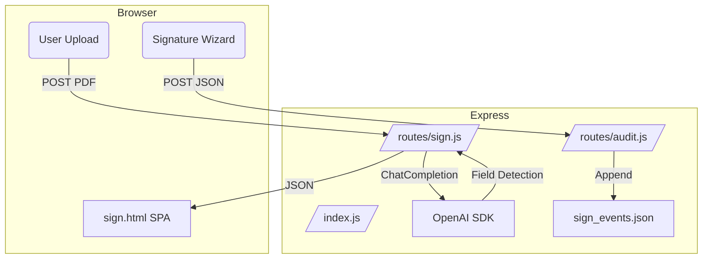
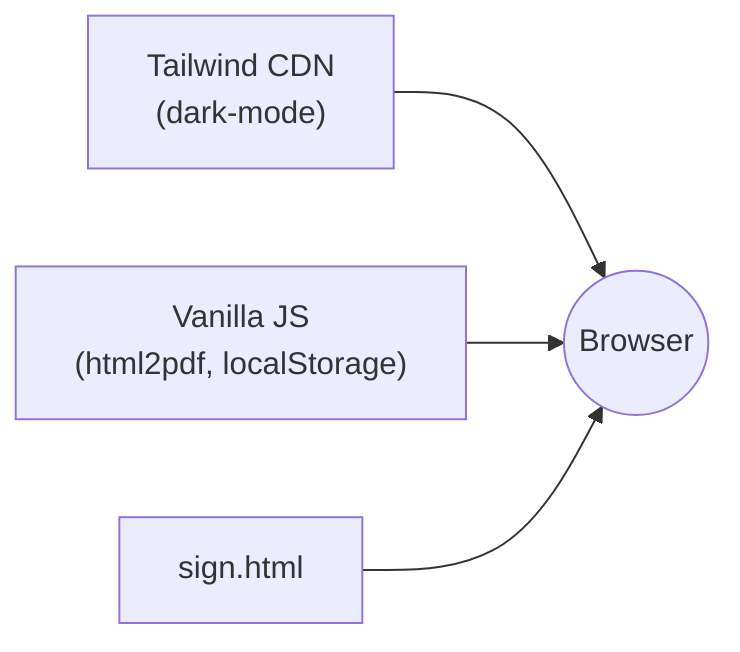

# SwiftSign Pipeline AI Tool

*AI‑powered document‑signing workflow & audit pipeline*

---

## Data Flow & Architecture


---

## Project Overview
This repo bundles a **single‑page application** (SPA) and **Node.js / Express backend** that together deliver instant, AI‑assisted e‑signature flows, from upload to legally‑compliant audit trail.

The backend exposes REST endpoints that turn clinician‑ or client‑supplied PDF documents into sign‑ready envelopes using **OpenAI GPT‑4o** for field detection, then tracks every signature event in JSON for transparent auditing.

---

## Features
| Feature | Description |
|---------|-------------|
| ✒️ **Smart Field Detection** | GPT‑4o detects and tags signature, date & initials boxes in any PDF. |
| 🔍 **OCR + Search** | Full‑text search across uploaded documents for instant navigation. |
| 📄 **Audit Trail** | All signer actions recorded in **`/server/data/sign_events.json`**—no database required. |
| 🎨 **Tailwind UI** | Responsive, dark‑mode‑aware front‑end ready for print & PDF export. |
| 🔐 **.env Support** | Backend reads `OPENAI_API_KEY` from environment variables—never hard‑coded. |

---

## Directory Structure
```txt
root
└── server                  # Backend + static SPA
    ├── data
    │   └── sign_events.json       # Signature / audit logs
    ├── public              # Front‑end (served as static assets)
    │   ├── assets/logo.png # Branding
    │   ├── sign.html       # SPA (Tailwind + Vanilla JS)
    │   └── workspace.code-workspace
    ├── routes
    │   ├── sign.js         # POST /api/sign – OpenAI logic
    │   └── audit.js        # POST /api/audit – append audit JSON
    ├── index.js            # Express entry‑point
    ├── package.json        # NPM metadata
    └── .gitignore          # Node / editor ignores
```

---

### Static Asset Pipeline


---

## Screenshots
| Light Mode | Dark Mode |
|------------|-----------|
|  |  |

---

## Contributing
1. Fork 🔧
2. Create feature branch → `git checkout -b feat/awesome‑thing`
3. Commit → `git commit -m "feat: awesome thing"`
4. Open pull request (PR template included)

Please **_never_ commit `.env`** or confidential documents.

---

## License
Distributed under the MIT License. See `LICENSE` for details.

---

> *Built with ❤️ by the SwiftSign Team – v1.0 © 2025*

